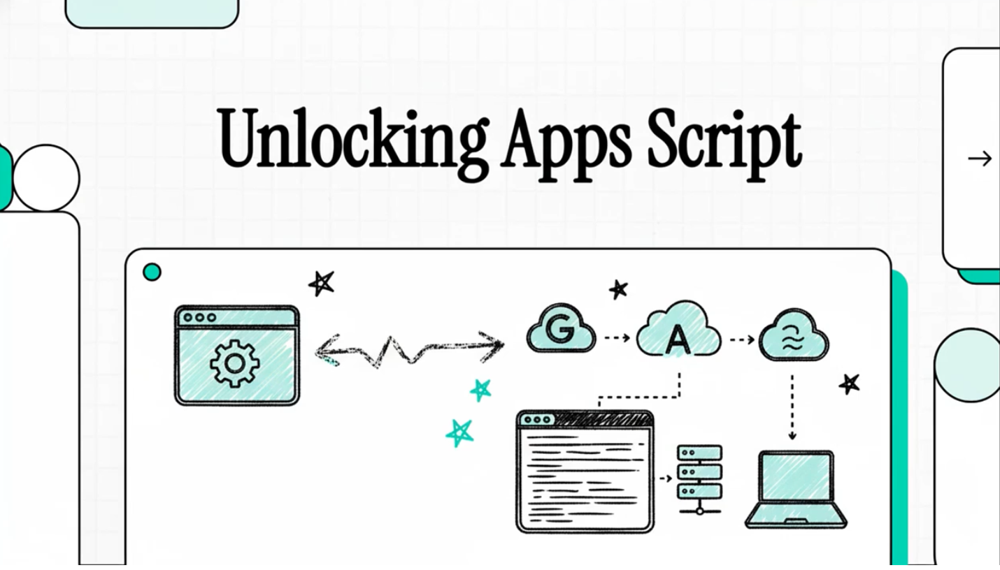

# KSuite Integration: Apps Script as a "Lingua Franca"

This document explains the architectural changes made to `gas-fakes` to support **Infomaniak KSuite** as a target platform. The core objective is to allow standard Google Apps Script code to run against non-Google platforms with zero or minimal modification.

## 1. The "Lingua Franca" Concept

The idea is to use the Google Apps Script API surface (e.g., `DriveApp`, `SpreadsheetApp`) as a universal interface for workspace products. 

*   **Logic**: Your business logic remains written in standard GAS.
*   **Steering**: You tell `gas-fakes` which backend to use via `ScriptApp.__platform`.
*   **Translation**: `gas-fakes` intercepts the calls and translates them to the target platform's API (in this case, Infomaniak V3).

## 2. Architectural Overview

### Platform Steering
A new property `__platform` was added to the `ScriptApp` global.
*   `ScriptApp.__platform = 'google'` (Default): Hits Google APIs.
*   `ScriptApp.__platform = 'ksuite'`: Intercepts calls and routes them to the KSuite translation layer.
*   `ScriptApp.__platform = 'msgraph'`: Intercepts calls and routes them to the Microsoft Graph (OneDrive) translation layer.

### Interception Point
The translation happens at the `Syncit` / Worker level. When a script calls `DriveApp.getRootFolder()`, the request is sent to the worker thread. The worker checks `Auth.getPlatform()` and, if set to `ksuite`, routes the request through the `KSuiteDrive` translator instead of the standard `googleapis` client.

## 3. KSuite Implementation Details

### Dynamic Discovery
Infomaniak's API is multi-tenant and requires specific IDs (`account_id`, `drive_id`). To keep the experience seamless, `gas-fakes` performs **Dynamic Discovery**:
1.  **Account Discovery**: Probes `/1/account` or `/profile` to find the user's organization ID.
2.  **Drive Discovery**: Probes `/2/drive` or `/2/drive/preferences` to find the default kDrive ID.
3.  **Caching**: These IDs are discovered once and cached for the remainder of the session to ensure high performance.

### Idiomatic Root Mapping
In Google Drive, the root is "My Drive". In KSuite, the Super Root (ID `1`) contains both "Private" and "Common documents". 
To match GAS expectations, `gas-fakes` **dynamically maps the "Private" folder as the Root**.
*   `DriveApp.getRootFolder()` resolves to the user's "Private" folder.
*   Files created in "root" land in "Private".

### Metadata Translation
The `KSuiteDrive.translateFile` method maps KSuite's JSON response to the schema expected by `gas-fakes` service classes:
*   `mime_type` -> `mimeType`
*   `created_at` -> `createdTime`
*   `last_modified_at` -> `modifiedTime`
*   Root detection (ID `1` or `5`) maps to the standard folder behavior.

## 4. Supported Operations (POC)

The current integration supports the following `DriveApp` and `Drive` advanced service operations on KSuite:
*   **Navigation**: `getRootFolder()`, `getFolders()`, `getFiles()`, `getFolderById()`, `getFileById()`.
*   **Creation**: `createFolder()`, `createFile()` (with content and type).
*   **Management**: `setName()`, `setTrashed()`.
*   **Content**: `getBlob()`, `getDataAsString()`.
*   **Queries**: Basic `q` parameter parsing for parent and `mimeType` filtering.

## 5. Setup & Usage

### 1. Initialization
Use the refactored `init` command to set up KSuite. When prompted, select both `google` and `ksuite` (or just `ksuite` if preferred).

```bash
gas-fakes init -b google -b ksuite
```

### 2. Environment Configuration
The `init` command will update your `.env` file with the necessary variables. Ensure `GF_PLATFORM_AUTH` includes `ksuite`, and add your Infomaniak API token:

```env
GF_PLATFORM_AUTH=google,ksuite
KSUITE_TOKEN=your_infomaniak_api_token
```

`gas-fakes` uses `override: true` to ensure local tokens always take precedence.

### 3. Authentication
Run the `auth` command specifically for the `ksuite` backend to ensure your token is valid:

```bash
gas-fakes auth --backend ksuite
```

### Example Code
```javascript
import '@mcpher/gas-fakes'

const main = () => {
  // Switch to KSuite
  ScriptApp.__platform = 'ksuite';

  // This code is now running against Infomaniak kDrive!
  const root = DriveApp.getRootFolder();
  console.log("Root Folder:", root.getName()); 

  const folder = root.createFolder("GAS-Fakes-Test");
  folder.createFile("hello.txt", "This was created via standard GAS code.");
  
  const files = folder.getFiles();
  while (files.hasNext()) {
    console.log("Found file:", files.next().getName());
  }
}
```

## 6. Testing

Tests are located in `test/testksuitedrive.js`. You can run them via npm:
```bash
cd test && npm run testksuitedrive
```
The test suite validates the full lifecycle: Discovery -> Mapping -> Creation -> Renaming -> Deletion.

##  Further Reading

## Watch the video

[](https://youtu.be/oEjpIrkYpEM)

## Read more docs

- [gas fakes intro video](https://youtu.be/oEjpIrkYpEM)
- [getting started](GETTING_STARTED.md) - how to handle authentication for restricted scopes.
- [readme](README.md)
- [gas fakes cli](gas-fakes-cli.md)
- [ksuite as a back end](ksuite_poc.md)
- [msgraph as a back end](msgraph.md)
- [gas-fakes in serverless containers](https://docs.google.com/presentation/d/1JlXF9T--DD4ERHopyP3WyAMhjRCxxHblgCP5ynxaJ3k/edit?usp=sharing)
- [apps script - a lingua franca for workspace platforms](https://ramblings.mcpher.com/apps-script-a-lingua-franca/)
- [Apps Script: A ‘Lingua Franca’ for the Multi-Cloud Era](https://ramblings.mcpher.com/apps-script-with-ksuite/)
- [running gas-fakes on google cloud run](https://github.com/brucemcpherson/gas-fakes-containers)
- [running gas-fakes on google kubernetes engine](https://github.com/brucemcpherson/gas-fakes-containers)
- [running gas-fakes on Amazon AWS lambda](https://github.com/brucemcpherson/gas-fakes-containers)
- [running gas-fakes on Azure ACA](https://github.com/brucemcpherson/gas-fakes-containers)
- [Yes – you can run native apps script code on Azure ACA as well!](https://ramblings.mcpher.com/yes-you-can-run-native-apps-script-code-on-azure-aca-as-well/)
- [Yes – you can run native apps script code on AWS Lambda!](https://ramblings.mcpher.com/apps-script-on-aws-lambda/)
- [initial idea and thoughts](https://ramblings.mcpher.com/a-proof-of-concept-implementation-of-apps-script-environment-on-node/)
- [Inside the volatile world of a Google Document](https://ramblings.mcpher.com/inside-the-volatile-world-of-a-google-document/)
- [Apps Script Services on Node – using apps script libraries](https://ramblings.mcpher.com/apps-script-services-on-node-using-apps-script-libraries/)
- [Apps Script environment on Node – more services](https://ramblings.mcpher.com/apps-script-environment-on-node-more-services/)
- [Turning async into synch on Node using workers](https://ramblings.mcpher.com/turning-async-into-synch-on-node-using-workers/)
- [All about Apps Script Enums and how to fake them](https://ramblings.mcpher.com/all-about-apps-script-enums-and-how-to-fake-them/)
- [colaborators](collaborators.md) - additional information for collaborators
- [oddities](oddities.md) - a collection of oddities uncovered during this project
- [named colors](named-colors.md)
- [sandbox](sandbox.md)
- [senstive scopes](senstive_scopes.md)
- [using apps script libraries with gas-fakes](libraries.md)
- [how libhandler works](libhandler.md)
- [article:using apps script libraries with gas-fakes](https://ramblings.mcpher.com/how-to-use-apps-script-libraries-directly-from-node/)
- [named range identity](named-range-identity.md)
- [sensitive scopes with local authentication](senstive_scopes.md)
- [push test pull](pull-test-push.md)
- [sharing cache and properties between gas-fakes and live apps script](https://ramblings.mcpher.com/sharing-cache-and-properties-between-gas-fakes-and-live-apps-script/)
- [gas-fakes-cli now has built in mcp server and gemini extension](https://ramblings.mcpher.com/gas-fakes-cli-now-has-built-in-mcp-server-and-gemini-extension/)
- [gas-fakes CLI: Run apps script code directly from your terminal](https://ramblings.mcpher.com/gas-fakes-cli-run-apps-script-code-directly-from-your-terminal/)
- [How to allow access to sensitive scopes with Application Default Credentials](https://ramblings.mcpher.com/how-to-allow-access-to-sensitive-scopes-with-application-default-credentials/)
- [Supercharge Your Google Apps Script Caching with GasFlexCache](https://ramblings.mcpher.com/supercharge-your-google-apps-script-caching-with-gasflexcache/)
- [Fake-Sandbox for Google Apps Script: Granular controls.](https://ramblings.mcpher.com/fake-sandbox-for-google-apps-script-granular-controls/)
- [A Fake-Sandbox for Google Apps Script: Securely Executing Code Generated by Gemini CLI](https://ramblings.mcpher.com/gas-fakes-sandbox/)
- [Power of Google Apps Script: Building MCP Server Tools for Gemini CLI and Google Antigravity in Google Workspace Automation](https://medium.com/google-cloud/power-of-google-apps-script-building-mcp-server-tools-for-gemini-cli-and-google-antigravity-in-71e754e4b740)
- [A New Era for Google Apps Script: Unlocking the Future of Google Workspace Automation with Natural Language](https://medium.com/google-cloud/a-new-era-for-google-apps-script-unlocking-the-future-of-google-workspace-automation-with-natural-a9cecf87b4c6)
- [Next-Generation Google Apps Script Development: Leveraging Antigravity and Gemini 3.0](https://medium.com/google-cloud/next-generation-google-apps-script-development-leveraging-antigravity-and-gemini-3-0-c4d5affbc1a8)
- [Modern Google Apps Script Workflow Building on the Cloud](https://medium.com/google-cloud/modern-google-apps-script-workflow-building-on-the-cloud-2255dbd32ac3)
- [Bridging the Gap: Seamless Integration for Local Google Apps Script Development](https://medium.com/@tanaike/bridging-the-gap-seamless-integration-for-local-google-apps-script-development-9b9b973aeb02)
- [Next-Level Google Apps Script Development](https://medium.com/google-cloud/next-level-google-apps-script-development-654be5153912)
- [Secure and Streamlined Google Apps Script Development with gas-fakes CLI and Gemini CLI Extension](https://medium.com/google-cloud/secure-and-streamlined-google-apps-script-development-with-gas-fakes-cli-and-gemini-cli-extension-67bbce80e2c8)
- [Secure and Conversational Google Workspace Automation: Integrating Gemini CLI with a gas-fakes MCP Server](https://medium.com/google-cloud/secure-and-conversational-google-workspace-automation-integrating-gemini-cli-with-a-gas-fakes-mcp-0a5341559865)
- [A Fake-Sandbox for Google Apps Script: A Feasibility Study on Securely Executing Code Generated by Gemini CL](https://medium.com/google-cloud/a-fake-sandbox-for-google-apps-script-a-feasibility-study-on-securely-executing-code-generated-by-cc985ce5dae3)
