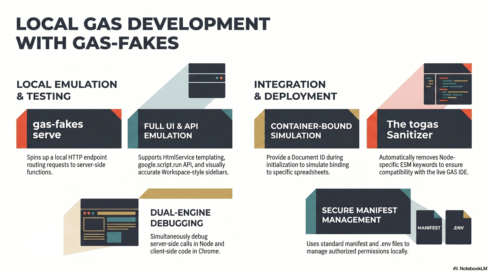

#  Microsoft Graph & OneDrive Authentication in `gas-fakes`

`gas-fakes` provides a "Keyless" and "Silent" runtime for Microsoft Graph, allowing your Google Apps Script code to interact with OneDrive as if it were performing native Drive operations.

## Key Principles

- **Zero-Cache**: Authentication tokens are **never** stored in local files. `gas-fakes` relies entirely on the OS-level Azure CLI cache or in-memory credentials.
- **Silent Runtime**: Once authorized, subsequent executions are 100% silent, leveraging a hardened CLI fallback mechanism.
- **Worker-Thread Auth**: All authentication logic, including interactive fallbacks, is handled within the worker thread to maintain synchronous execution in your main script.
- **Local Cache**: To eliminate redundant login prompts, tokens can be stored locally in `.msgraph-token.jwt`. **See Security Advisory below.**
- **Automatic Refresh**: If the cached access token expires, `gas-fakes` automatically falls back to the Azure CLI to refresh it silently.

---

## Getting Started

### 1. Requirements
You must have the **Azure CLI (`az`)** installed on your machine.
[Install Azure CLI](https://learn.microsoft.com/en-us/cli/azure/install-azure-cli)

### 2. Initialization
Run the `gas-fakes` initialization and select `msgraph` as a backend (you can also the other backends mentioned for multi client use - this example sets up gas-fakes to use any or all of google workspace, ms graph or ksuite):
```bash
gas-fakes init -b msgraph,google,ksuite
```
This will add `msgraph,google,ksuite` to your `GF_PLATFORM_AUTH` in the `.env` file.

### 3. One-Time Setup
To populate the OS-level cache for silent runs, perform a one-time login:
```bash
gas-fakes auth 
```
- **Quiet Experience**: `gas-fakes` automatically suppresses redundant subscription selectors and verbose JSON output for a professional onboarding experience.
- **Silent Fallback**: This process enables the "Silent Runtime" for all future executions.

---

## Important Caveats & "Oddities"

Note that I don't have any Microsoft licenses, or a business account, and apparently I don't qualify for the Microsoft developer program that would allow me to get one. I've attempted to theoritically support theses and other scenarios, but I've only been able to test on personal accounts. If you're a gas-fakes user and have a business account,and other Microsoft license variants, I'd love to hear about your experiences - and would welcome any collaboration you can provide for this open source project. 

### 1. Consumer (Personal) Account Focus
Currently, `gas-fakes` has been **only tested with Personal Microsoft Accounts (OneDrive Personal)**. While it supports custom App Registrations, personal accounts are the most stable path for "keyless" local development. The default tenant used for fallback is now `consumers`.

### 2. The "SPO License" Error
If you are using a Business account, a Guest account, or an External (EXT) identity, you may encounter a `400 Bad Request: Tenant does not have a SPO license` error.
- **Why?**: Microsoft Graph requires a SharePoint Online (SPO) license to access the `/me/drive` endpoint. Many business guest accounts or restricted identities do not have this license assigned.
- **Resolution**: Ensure you are logged into an account with an active OneDrive/SharePoint license, or use a standard Personal account. If other issues arise please log an issue on github as this track has not yet been able to be tested.

### 3. "Unwanted" Interactive Login
If the silent CLI fallback fails, `gas-fakes` might trigger an **interactive browser fallback** directly from the worker threa, although it should be able to take care of this silently. If you see this raise an issue along with details of your environment.
- **Behavior**: A browser window will open to request consent or credentials, just needing your consent.


---

## Security Advisory: Local Token Storage

For consumer accounts, `gas-fakes` caches MS Graph tokens in a local file called `.msgraph-token.jwt` in your project root.

### Risks
1. **Locally Signed JWT Storage**: Tokens are stored as a locally-signed JWT (JSON Web Token), rather than plaintext JSON. While `gas-fakes` also sets restrictive file permissions (`chmod 600`), and this prevents casual viewing and tampering, the token is still readable by the node process.
2. **Persistence**: These tokens grant persistent access to your OneDrive/SharePoint resources until they expire along with the ability to silently refresh.
3. **Commit Risk**: **CRITICAL**: Ensure `**/.msgraph-token.jwt` is added to your `.gitignore`. Pushing this file to a public repository could expose some token info. 

### Mitigations
- `gas-fakes` automatically adds `.msgraph-token.jwt` to `.gitignore` during `init`.
- If you prefer a "Zero-Cache" approach, delete the `.msgraph-token.jwt` file and rely on the Azure CLI cache (which may require occasional re-auth).

---

## Technical Details

### Silent Fallback Hierarchy
When your script requests a token, `gas-fakes` attempts the following in order:
1. **Local Token Cache**: Checks `.msgraph-token.jwt` for a valid, non-expired token or a way to refresh one.
2. **Custom Client ID + Tenant**: Uses your `.env` configuration for your specific App Registration.
3. **Universal CLI Fallback**: Automatically picks up the active Azure CLI session from your machine, defaulting to `consumers` if no specific tenant is provided.
4. **Interactive Fallback**: Opens a browser if all silent methods fail, also defaulting to the `consumers` tenant.

### Programmatic Auth Status
You can check if a platform is authorized directly from your script:
```javascript
if (ScriptApp.__isPlatformAuthed('msgraph')) {
  console.log('MS Graph is ready!');
}
console.log('Currently authorized platforms:', ScriptApp.__platforms);
```

### Environment Variables
Managed via `gas-fakes init`:

##  Further Reading

## Watch the gas-fakes intro video

[](https://youtu.be/oEjpIrkYpEM)

## Watch the gf_agent video on natural language automation

[](https://youtu.be/lujByoX71HU)

## Watch the local webapps and addons development video

[](https://youtu.be/vH9wl7QloZ4)

## Read more docs

- [release notes](../versionnotes/)
- [gas fakes intro video](https://youtu.be/oEjpIrkYpEM)
- [getting started](../GETTING_STARTED.md) - how to handle authentication for Workspace scopes.
- [readme](../README.md)
- [Natural Language Automation with Gemini Skills & MCP Server](../notes/gemini-skills-mcp.md) - new skills-based agent approach.
- [Add agent skills to gf_agent](https://ramblings.mcpher.com/add-skills-gf_agent/)
- [gf_agent documentation](../../gf_agent/README.md) - instructions for the Gemini CLI automation agent and MCP server.
- [gas fakes cli](../notes/gas-fakes-cli.md)
- [local add-on and webapp development with gas-fakes](../notes/local-web-development.md)
- [Bringing the webapp home](https://ramblings.mcpher.com/local-apps-script-webapp-and-ui-emulation/)
- [Local development example code](https://github.com/brucemcpherson/gf-serve)
- [github actions using adc](https://github.com/brucemcpherson/gas-fakes-actions-adc)
- [github actions using dwd and wif](https://github.com/brucemcpherson/gas-fakes-actions-dwd)
- [ksuite as a back end](../notes/ksuite_poc.md)
- [msgraph as a back end](../notes/msgraph.md)
- [resurrecting scriptDb repo](https://github.com/brucemcpherson/scriptdb-redux)
- [Resurrecting ScriptDb – nosql database for Apps Script](https://ramblings.mcpher.com/resurrecting-scriptdb-nosql-database-for-apps-script/)
- [gas-fakes in serverless containers](https://docs.google.com/presentation/d/1JlXF9T--DD4ERHopyP3WyAMhjRCxxHblgCP5ynxaJ3k/edit?usp=sharing)
- [apps script - a lingua franca for workspace platforms](https://ramblings.mcpher.com/apps-script-a-lingua-franca/)
- [Apps Script: A ‘Lingua Franca’ for the Multi-Cloud Era](https://ramblings.mcpher.com/apps-script-with-ksuite/)
- [running gas-fakes on google cloud run](https://github.com/brucemcpherson/gas-fakes-containers)
- [running gas-fakes on google kubernetes engine](https://github.com/brucemcpherson/gas-fakes-containers)
- [running gas-fakes on Amazon AWS lambda](https://github.com/brucemcpherson/gas-fakes-containers)
- [running gas-fakes on Azure ACA](https://github.com/brucemcpherson/gas-fakes-containers)
- [running gas-fakes on Github actions](https://github.com/brucemcpherson/gas-fakes-containers)
- [jdbc notes](../notes/jdbc-notes.md)
- [Yes – you can run native apps script code on Azure ACA as well!](https://ramblings.mcpher.com/yes-you-can-run-native-apps-script-code-on-azure-aca-as-well/)
- [Yes – you can run native apps script code on AWS Lambda!](https://ramblings.mcpher.com/apps-script-on-aws-lambda/)
- [initial idea and thoughts](https://ramblings.mcpher.com/a-proof-of-concept-implementation-of-apps-script-environment-on-node/)
- [Inside the volatile world of a Google Document](https://ramblings.mcpher.com/inside-the-volatile-world-of-a-google-document/)
- [Apps Script Services on Node – using apps script libraries](https://ramblings.mcpher.com/apps-script-services-on-node-using-apps-script-libraries/)
- [Apps Script environment on Node – more services](https://ramblings.mcpher.com/apps-script-environment-on-node-more-services/)
- [Turning async into synch on Node using workers](https://ramblings.mcpher.com/turning-async-into-synch-on-node-using-workers/)
- [All about Apps Script Enums and how to fake them](https://ramblings.mcpher.com/all-about-apps-script-enums-and-how-to-fake-them/)
- [colaborators](../collaborators.md) - additional information for collaborators
- [oddities](../notes/oddities.md) - a collection of oddities uncovered during this project
- [named colors](../notes/named-colors.md)
- [sandbox](../notes/sandbox.md)
- [senstive scopes](../notes/workspace_scopes.md)
- [using apps script libraries with gas-fakes](../notes/libraries.md)
- [how libhandler works](../libhandler.md)
- [article:using apps script libraries with gas-fakes](https://ramblings.mcpher.com/how-to-use-apps-script-libraries-directly-from-node/)
- [named range identity](../notes/named-range-identity.md)
- [Workspace scopes with local authentication](../notes/workspace_scopes.md)
- [sharing cache and properties between gas-fakes and live apps script](https://ramblings.mcpher.com/sharing-cache-and-properties-between-gas-fakes-and-live-apps-script/)
- [gas-fakes-cli now has built in mcp server and gemini extension](https://ramblings.mcpher.com/gas-fakes-cli-now-has-built-in-mcp-server-and-gemini-extension/)
- [gas-fakes CLI: Run apps script code directly from your terminal](https://ramblings.mcpher.com/gas-fakes-cli-run-apps-script-code-directly-from-your-terminal/)
- [How to allow access to Workspace scopes with Application Default Credentials](https://ramblings.mcpher.com/how-to-allow-access-to-sensitive-scopes-with-application-default-credentials/)
- [Supercharge Your Google Apps Script Caching with GasFlexCache](https://ramblings.mcpher.com/supercharge-your-google-apps-script-caching-with-gasflexcache/)
- [Fake-Sandbox for Google Apps Script: Granular controls.](https://ramblings.mcpher.com/fake-sandbox-for-google-apps-script-granular-controls/)
- [A Fake-Sandbox for Google Apps Script: Securely Executing Code Generated by Gemini CLI](https://ramblings.mcpher.com/gas-fakes-sandbox/)
- [Power of Google Apps Script: Building MCP Server Tools for Gemini CLI and Google Antigravity in Google Workspace Automation](https://medium.com/google-cloud/power-of-google-apps-script-building-mcp-server-tools-for-gemini-cli-and-google-antigravity-in-71e754e4b740)
- [A New Era for Google Apps Script: Unlocking the Future of Google Workspace Automation with Natural Language](https://medium.com/google-cloud/a-new-era-for-google-apps-script-unlocking-the-future-of-google-workspace-automation-with-natural-a9cecf87b4c6)
- [Next-Generation Google Apps Script Development: Leveraging Antigravity and Gemini 3.0](https://medium.com/google-cloud/next-generation-google-apps-script-development-leveraging-antigravity-and-gemini-3-0-c4d5affbc1a8)
- [Modern Google Apps Script Workflow Building on the Cloud](https://medium.com/google-cloud/modern-google-apps-script-workflow-building-on-the-cloud-2255dbd32ac3)
- [Bridging the Gap: Seamless Integration for Local Google Apps Script Development](https://medium.com/@tanaike/bridging-the-gap-seamless-integration-for-local-google-apps-script-development-9b9b973aeb02)
- [Next-Level Google Apps Script Development](https://medium.com/google-cloud/next-level-google-apps-script-development-654be5153912)
- [Secure and Streamlined Google Apps Script Development with gas-fakes CLI and Gemini CLI Extension](https://medium.com/google-cloud/secure-and-streamlined-google-apps-script-development-with-gas-fakes-cli-and-gemini-cli-extension-67bbce80e2c8)
- [Secure and Conversational Google Workspace Automation: Integrating Gemini CLI with a gas-fakes MCP Server](https://medium.com/google-cloud/secure-and-conversational-google-workspace-automation-integrating-gemini-cli-with-a-gas-fakes-mcp-0a5341559865)
- [A Fake-Sandbox for Google Apps Script: A Feasibility Study on Securely Executing Code Generated by Gemini CL](https://medium.com/google-cloud/a-fake-sandbox-for-google-apps-script-a-feasibility-study-on-securely-executing-code-generated-by-cc985ce5dae3)

