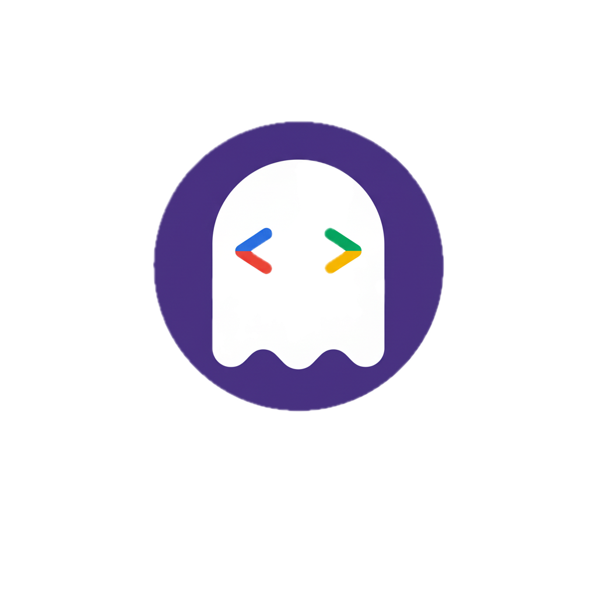

# v2.2.6

## Microsoft Graph Authentication
- **Persistent Token Cache**: Implemented a custom MSAL token cache persistence plugin for Microsoft Graph. This allows for silent, headless token refresh across different Node.js process runs without relying on OS-specific secure stores (like macOS Keychain or Windows DPAPI), making it fully compatible with **Cloud Run** and ephemeral CI/CD environments.
- **Silent Refresh**: Fixed an issue where expired MS Graph access tokens would trigger an unwanted interactive browser login. The SDK now correctly leverages the `refresh_token` stored within the encrypted `.msgraph-token.jwt` file.

## Security & Dependency Updates
- **ReDoS Vulnerability Fix**: Addressed a security alert (CVE-2022-3517) regarding `minimatch` in transitive dependencies by updating `glob` and enforcing secure resolutions across the workspace.
- **Dependency Cleanup**: Synchronized `package.json` with actual code usage. Explicitly added `google-auth-library` as a direct dependency and removed unused legacy packages.

## Silencing NPM Deprecation Warnings
Some transitive dependencies (via `archiver` and `googleapis`) still reference deprecated versions of `glob`. While these are harmless, they can be noisy during `npm install`.

You can silence some of these warnings in your own project by adding an `overrides` section to your `package.json`. Others may need to wait till the referenced packages are updated (namely googleapis):

```json
{
  "overrides": {
    "glob": "^13.0.6"
  }
}
```

This forces npm to resolve to a modern, non-deprecated version of `glob` across your entire dependency tree.


2026-03-18T11:06:46.057Z [Info] Total passes 10399 (100.0%) Total failures 0 (0.0%)
2026-03-18T11:06:46.057Z [Info] ALL TESTS PASSED

##  Further Reading

## Watch the video

[](https://youtu.be/oEjpIrkYpEM)

## Read more docs

- [gas fakes intro video](https://youtu.be/oEjpIrkYpEM)
- [getting started](GETTING_STARTED.md) - how to handle authentication for Workspace scopes.
- [readme](README.md)
- [gas fakes cli](gas-fakes-cli.md)
- [ksuite as a back end](ksuite_poc.md)
- [msgraph as a back end](msgraph.md)
- [gas-fakes in serverless containers](https://docs.google.com/presentation/d/1JlXF9T--DD4ERHopyP3WyAMhjRCxxHblgCP5ynxaJ3k/edit?usp=sharing)
- [apps script - a lingua franca for workspace platforms](https://ramblings.mcpher.com/apps-script-a-lingua-franca/)
- [Apps Script: A ‘Lingua Franca’ for the Multi-Cloud Era](https://ramblings.mcpher.com/apps-script-with-ksuite/)
- [running gas-fakes on google cloud run](https://github.com/brucemcpherson/gas-fakes-containers)
- [running gas-fakes on google kubernetes engine](https://github.com/brucemcpherson/gas-fakes-containers)
- [running gas-fakes on Amazon AWS lambda](https://github.com/brucemcpherson/gas-fakes-containers)
- [running gas-fakes on Azure ACA](https://github.com/brucemcpherson/gas-fakes-containers)
- [Yes – you can run native apps script code on Azure ACA as well!](https://ramblings.mcpher.com/yes-you-can-run-native-apps-script-code-on-azure-aca-as-well/)
- [Yes – you can run native apps script code on AWS Lambda!](https://ramblings.mcpher.com/apps-script-on-aws-lambda/)
- [initial idea and thoughts](https://ramblings.mcpher.com/a-proof-of-concept-implementation-of-apps-script-environment-on-node/)
- [Inside the volatile world of a Google Document](https://ramblings.mcpher.com/inside-the-volatile-world-of-a-google-document/)
- [Apps Script Services on Node – using apps script libraries](https://ramblings.mcpher.com/apps-script-services-on-node-using-apps-script-libraries/)
- [Apps Script environment on Node – more services](https://ramblings.mcpher.com/apps-script-environment-on-node-more-services/)
- [Turning async into synch on Node using workers](https://ramblings.mcpher.com/turning-async-into-synch-on-node-using-workers/)
- [All about Apps Script Enums and how to fake them](https://ramblings.mcpher.com/all-about-apps-script-enums-and-how-to-fake-them/)
- [colaborators](collaborators.md) - additional information for collaborators
- [oddities](oddities.md) - a collection of oddities uncovered during this project
- [named colors](named-colors.md)
- [sandbox](sandbox.md)
- [senstive scopes](workspace_scopes.md)
- [using apps script libraries with gas-fakes](libraries.md)
- [how libhandler works](libhandler.md)
- [article:using apps script libraries with gas-fakes](https://ramblings.mcpher.com/how-to-use-apps-script-libraries-directly-from-node/)
- [named range identity](named-range-identity.md)
- [Workspace scopes with local authentication](workspace_scopes.md)
- [push test pull](pull-test-push.md)
- [sharing cache and properties between gas-fakes and live apps script](https://ramblings.mcpher.com/sharing-cache-and-properties-between-gas-fakes-and-live-apps-script/)
- [gas-fakes-cli now has built in mcp server and gemini extension](https://ramblings.mcpher.com/gas-fakes-cli-now-has-built-in-mcp-server-and-gemini-extension/)
- [gas-fakes CLI: Run apps script code directly from your terminal](https://ramblings.mcpher.com/gas-fakes-cli-run-apps-script-code-directly-from-your-terminal/)
- [How to allow access to Workspace scopes with Application Default Credentials](https://ramblings.mcpher.com/how-to-allow-access-to-sensitive-scopes-with-application-default-credentials/)
- [Supercharge Your Google Apps Script Caching with GasFlexCache](https://ramblings.mcpher.com/supercharge-your-google-apps-script-caching-with-gasflexcache/)
- [Fake-Sandbox for Google Apps Script: Granular controls.](https://ramblings.mcpher.com/fake-sandbox-for-google-apps-script-granular-controls/)
- [A Fake-Sandbox for Google Apps Script: Securely Executing Code Generated by Gemini CLI](https://ramblings.mcpher.com/gas-fakes-sandbox/)
- [Power of Google Apps Script: Building MCP Server Tools for Gemini CLI and Google Antigravity in Google Workspace Automation](https://medium.com/google-cloud/power-of-google-apps-script-building-mcp-server-tools-for-gemini-cli-and-google-antigravity-in-71e754e4b740)
- [A New Era for Google Apps Script: Unlocking the Future of Google Workspace Automation with Natural Language](https://medium.com/google-cloud/a-new-era-for-google-apps-script-unlocking-the-future-of-google-workspace-automation-with-natural-a9cecf87b4c6)
- [Next-Generation Google Apps Script Development: Leveraging Antigravity and Gemini 3.0](https://medium.com/google-cloud/next-generation-google-apps-script-development-leveraging-antigravity-and-gemini-3-0-c4d5affbc1a8)
- [Modern Google Apps Script Workflow Building on the Cloud](https://medium.com/google-cloud/modern-google-apps-script-workflow-building-on-the-cloud-2255dbd32ac3)
- [Bridging the Gap: Seamless Integration for Local Google Apps Script Development](https://medium.com/@tanaike/bridging-the-gap-seamless-integration-for-local-google-apps-script-development-9b9b973aeb02)
- [Next-Level Google Apps Script Development](https://medium.com/google-cloud/next-level-google-apps-script-development-654be5153912)
- [Secure and Streamlined Google Apps Script Development with gas-fakes CLI and Gemini CLI Extension](https://medium.com/google-cloud/secure-and-streamlined-google-apps-script-development-with-gas-fakes-cli-and-gemini-cli-extension-67bbce80e2c8)
- [Secure and Conversational Google Workspace Automation: Integrating Gemini CLI with a gas-fakes MCP Server](https://medium.com/google-cloud/secure-and-conversational-google-workspace-automation-integrating-gemini-cli-with-a-gas-fakes-mcp-0a5341559865)
- [A Fake-Sandbox for Google Apps Script: A Feasibility Study on Securely Executing Code Generated by Gemini CL](https://medium.com/google-cloud/a-fake-sandbox-for-google-apps-script-a-feasibility-study-on-securely-executing-code-generated-by-cc985ce5dae3)
