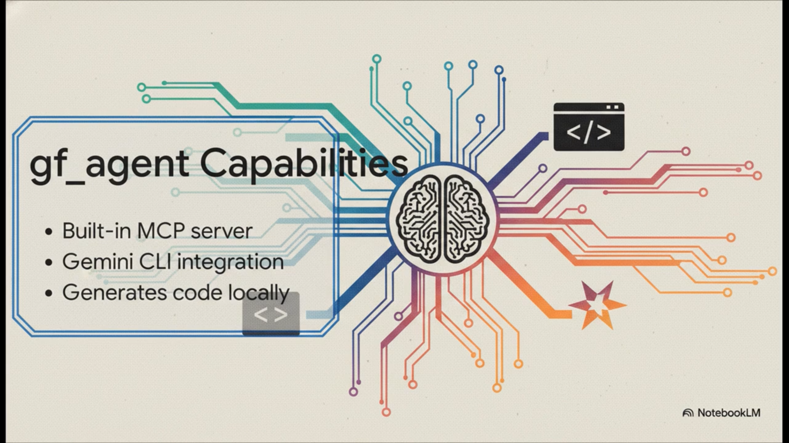

# gas-fakes v2.5.2 Release Notes

## Overview

Version 2.5.2 introduces an upgrade to local development capabilities: a built-in local web server and full emulation of Google Apps Script's HTML Service and UI framing. 

Developers can now build, test, and render Web Apps (`doGet` and `doPost`) entirely locally, complete with `google.script.run` RPC capabilities, template evaluation (`<?!= include() ?>`), and visual UI dialog framing (`SpreadsheetApp.getUi().showModalDialog()`).

## Key Features & Additions

### 1. Local Web Server (`gas-fakes serve`)
- Introduced the `gas-fakes serve <script.js>` command to instantly spin up a local HTTP server.
- The server automatically listens for GET and POST requests and routes them to your script's `doGet` or `doPost` functions.
- You can override the target GET entry point using the `?main=name` query parameter in the browser to test specific UI menus or dialogs (e.g., access `http://localhost:8080?main=showDialog`).

### 2. Full HTML Service & Content Service Parity
- Reached 100% documented API parity for both `HtmlService` and `ContentService`.
- Added robust support for `FakeHtmlTemplate` and `FakeHtmlOutput`. 
- `HtmlService.createTemplateFromFile()` dynamically resolves and loads local `.html` files relative to your script.
- Templating evaluation now runs in an isolated worker process that loads your local modules using standard ES module imports. This ensures that every evaluation starts with a fresh, clean-sheet environment that matches the Apps Script runtime perfectly, while allowing your code to use idiomatic Node.js ESM patterns.
- Automatic sanitization of client-side code: Template scriptlets and injected `<script>` tags are automatically stripped of Node.js-specific `import` and `export` statements, ensuring your shared code is browser-ready.

### 3. Client-Side RPC (`google.script.run`)
- The server automatically injects a `CLIENT_POLYFILL` into your HTML output.
- `google.script.run` is fully mocked on the client to perform fetch requests back to a local `/__gas_rpc` endpoint.
- Server-side functions executed via RPC run in an isolated worker instance that mimics the Apps Script global environment, with all your namespaces and exported modules (like `Include` or `Props`) exposed to `globalThis`.
- Supports `.withSuccessHandler()`, `.withFailureHandler()`, and `.withUserObject()`.
- Explicit argument validation mimics native GAS restrictions (rejects `undefined`, DOM `Elements`, and `Functions` prior to network dispatch).

### 4. UI Dimensional Framing (`getUi()`)
- Added `getUi()` methods to `SpreadsheetApp`, `DocumentApp`, `SlidesApp`, and `FormApp`.
- Locally calling `getUi().showModalDialog(html, title)` or `getUi().showSidebar(html)` will now dynamically inject CSS and an `iframe` wrapper around your HTML output.
- This creates a visual simulation of the Google Workspace container (with exact dimensions, drop shadows, and top-bars) directly in your browser tab when you test the endpoint!
- Added `google.script.host.close()` support via `postMessage` interception to allow dialogs to close themselves without hitting modern browser security blocks on `window.close()`.

### 5. Architectural Improvements
- Completely refactored `consumerworker.js` and module resolution. Scripts are now evaluated cleanly using standard Node.js dynamic ESM imports, eliminating version collisions and ensuring your local `package.json` dictates the exact dependencies loaded.
- Fixed a bug where downloaded mock libraries (via `LibHandlerApp`) would crash due to adjacent IIFEs lacking semicolons.

## Developer Experience & Debugging

- **Named Client-Side Modules**: Added documentation and support for using `//# sourceURL=gas-fakes:///...` to give client-side script blocks recognizable names in Chrome DevTools.
- **Improved Node.js Debugging**: Refined guidance for VS Code launch configurations, recommending `console: "integratedTerminal"` for reliable logging and explaining potential conflicts with `outputCapture: "std"` and manual `--inspect` flags.
- **SourceURL in Polyfill**: The automatically injected `CLIENT_POLYFILL` now includes `//# sourceURL=gas-fakes:///polyfill.js` for easier identification during front-end debugging.

*Enjoy building full-stack Workspace Add-ons locally!*

##  Further Reading

## Watch the gas-fakes intro video

## Watch the gf_agent video on natural language automation

## Read more docs

- [release notes](../versionnotes/)
- [gas fakes intro video](https://youtu.be/oEjpIrkYpEM)
- [getting started](../GETTING_STARTED.md) - how to handle authentication for Workspace scopes.
- [readme](../README.md)
- [Natural Language Automation with Gemini Skills & MCP Server](../notes/gemini-skills-mcp.md) - new skills-based agent approach.
- [Add agent skills to gf_agent](https://ramblings.mcpher.com/add-skills-gf_agent/)
- [gf_agent documentation](../../gf_agent/README.md) - instructions for the Gemini CLI automation agent and MCP server.
- [gas fakes cli](../notes/gas-fakes-cli.md)
-[local add-on and webapp development with gas-fakes](../notes/local-web-development.md)
- [github actions using adc](https://github.com/brucemcpherson/gas-fakes-actions-adc)
- [github actions using dwd and wif](https://github.com/brucemcpherson/gas-fakes-actions-dwd)
- [ksuite as a back end](../notes/ksuite_poc.md)
- [msgraph as a back end](../notes/msgraph.md)
- [resurrecting scriptDb repo](https://github.com/brucemcpherson/scriptdb-redux)
- [Resurrecting ScriptDb – nosql database for Apps Script](https://ramblings.mcpher.com/resurrecting-scriptdb-nosql-database-for-apps-script/)
- [gas-fakes in serverless containers](https://docs.google.com/presentation/d/1JlXF9T--DD4ERHopyP3WyAMhjRCxxHblgCP5ynxaJ3k/edit?usp=sharing)
- [apps script - a lingua franca for workspace platforms](https://ramblings.mcpher.com/apps-script-a-lingua-franca/)
- [Apps Script: A ‘Lingua Franca’ for the Multi-Cloud Era](https://ramblings.mcpher.com/apps-script-with-ksuite/)
- [running gas-fakes on google cloud run](https://github.com/brucemcpherson/gas-fakes-containers)
- [running gas-fakes on google kubernetes engine](https://github.com/brucemcpherson/gas-fakes-containers)
- [running gas-fakes on Amazon AWS lambda](https://github.com/brucemcpherson/gas-fakes-containers)
- [running gas-fakes on Azure ACA](https://github.com/brucemcpherson/gas-fakes-containers)
- [running gas-fakes on Github actions](https://github.com/brucemcpherson/gas-fakes-containers)
- [jdbc notes](../notes/jdbc-notes.md)
- [Yes – you can run native apps script code on Azure ACA as well!](https://ramblings.mcpher.com/yes-you-can-run-native-apps-script-code-on-azure-aca-as-well/)
- [Yes – you can run native apps script code on AWS Lambda!](https://ramblings.mcpher.com/apps-script-on-aws-lambda/)
- [initial idea and thoughts](https://ramblings.mcpher.com/a-proof-of-concept-implementation-of-apps-script-environment-on-node/)
- [Inside the volatile world of a Google Document](https://ramblings.mcpher.com/inside-the-volatile-world-of-a-google-document/)
- [Apps Script Services on Node – using apps script libraries](https://ramblings.mcpher.com/apps-script-services-on-node-using-apps-script-libraries/)
- [Apps Script environment on Node – more services](https://ramblings.mcpher.com/apps-script-environment-on-node-more-services/)
- [Turning async into synch on Node using workers](https://ramblings.mcpher.com/turning-async-into-synch-on-node-using-workers/)
- [All about Apps Script Enums and how to fake them](https://ramblings.mcpher.com/all-about-apps-script-enums-and-how-to-fake-them/)
- [colaborators](../collaborators.md) - additional information for collaborators
- [oddities](../notes/oddities.md) - a collection of oddities uncovered during this project
- [named colors](../notes/named-colors.md)
- [sandbox](../notes/sandbox.md)
- [senstive scopes](../notes/workspace_scopes.md)
- [using apps script libraries with gas-fakes](../notes/libraries.md)
- [how libhandler works](../libhandler.md)
- [article:using apps script libraries with gas-fakes](https://ramblings.mcpher.com/how-to-use-apps-script-libraries-directly-from-node/)
- [named range identity](../notes/named-range-identity.md)
- [Workspace scopes with local authentication](../notes/workspace_scopes.md)
- [sharing cache and properties between gas-fakes and live apps script](https://ramblings.mcpher.com/sharing-cache-and-properties-between-gas-fakes-and-live-apps-script/)
- [gas-fakes-cli now has built in mcp server and gemini extension](https://ramblings.mcpher.com/gas-fakes-cli-now-has-built-in-mcp-server-and-gemini-extension/)
- [gas-fakes CLI: Run apps script code directly from your terminal](https://ramblings.mcpher.com/gas-fakes-cli-run-apps-script-code-directly-from-your-terminal/)
- [How to allow access to Workspace scopes with Application Default Credentials](https://ramblings.mcpher.com/how-to-allow-access-to-sensitive-scopes-with-application-default-credentials/)
- [Supercharge Your Google Apps Script Caching with GasFlexCache](https://ramblings.mcpher.com/supercharge-your-google-apps-script-caching-with-gasflexcache/)
- [Fake-Sandbox for Google Apps Script: Granular controls.](https://ramblings.mcpher.com/fake-sandbox-for-google-apps-script-granular-controls/)
- [A Fake-Sandbox for Google Apps Script: Securely Executing Code Generated by Gemini CLI](https://ramblings.mcpher.com/gas-fakes-sandbox/)
- [Power of Google Apps Script: Building MCP Server Tools for Gemini CLI and Google Antigravity in Google Workspace Automation](https://medium.com/google-cloud/power-of-google-apps-script-building-mcp-server-tools-for-gemini-cli-and-google-antigravity-in-71e754e4b740)
- [A New Era for Google Apps Script: Unlocking the Future of Google Workspace Automation with Natural Language](https://medium.com/google-cloud/a-new-era-for-google-apps-script-unlocking-the-future-of-google-workspace-automation-with-natural-a9cecf87b4c6)
- [Next-Generation Google Apps Script Development: Leveraging Antigravity and Gemini 3.0](https://medium.com/google-cloud/next-generation-google-apps-script-development-leveraging-antigravity-and-gemini-3-0-c4d5affbc1a8)
- [Modern Google Apps Script Workflow Building on the Cloud](https://medium.com/google-cloud/modern-google-apps-script-workflow-building-on-the-cloud-2255dbd32ac3)
- [Bridging the Gap: Seamless Integration for Local Google Apps Script Development](https://medium.com/@tanaike/bridging-the-gap-seamless-integration-for-local-google-apps-script-development-9b9b973aeb02)
- [Next-Level Google Apps Script Development](https://medium.com/google-cloud/next-level-google-apps-script-development-654be5153912)
- [Secure and Streamlined Google Apps Script Development with gas-fakes CLI and Gemini CLI Extension](https://medium.com/google-cloud/secure-and-streamlined-google-apps-script-development-with-gas-fakes-cli-and-gemini-cli-extension-67bbce80e2c8)
- [Secure and Conversational Google Workspace Automation: Integrating Gemini CLI with a gas-fakes MCP Server](https://medium.com/google-cloud/secure-and-conversational-google-workspace-automation-integrating-gemini-cli-with-a-gas-fakes-mcp-0a5341559865)
- [A Fake-Sandbox for Google Apps Script: A Feasibility Study on Securely Executing Code Generated by Gemini CL](https://medium.com/google-cloud/a-fake-sandbox-for-google-apps-script-a-feasibility-study-on-securely-executing-code-generated-by-cc985ce5dae3)

